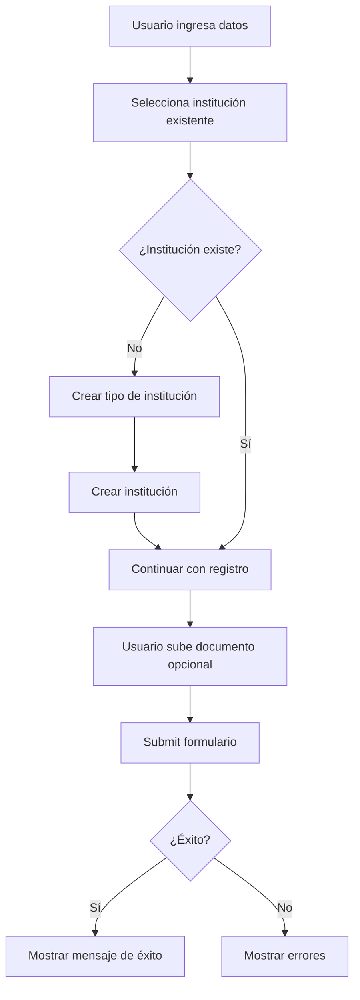

# Documentación de API - Endpoints

## Índice
1. [Autenticación](#autenticación)
2. [Academic Management](#academic-management)
   - [Degree Education (Grados Académicos)](#degree-education)
   - [Continuing Education (Educación Continua)](#continuing-education)
   - [Professional Certification (Certificaciones Profesionales)](#professional-certification)
3. [Institution Management](#institution-management)
   - [Institution Types (Tipos de Institución)](#institution-types)
   - [Institutions (Instituciones)](#institutions)

---

## Autenticación

Todos los endpoints requieren un token JWT válido en el header `Authorization`:

```
Authorization: Bearer {token}
```

### Obtención del Token

**Endpoint:** `POST /api/users/login`

**Request:**
```json
{
  "userName": "string",
  "password": "string"
}
```

**Response:**
```json
{
  "wasSuccessful": true,
  "message": "Inicio de sesión exitoso.",
  "data": {
    "token": "eyJhbGciOiJIUzI1NiIsInR5cCI6IkpXVCJ9...",
    "user": {
      "id": "guid",
      "userName": "string",
      "email": "string",
      "fullName": "string",
      "role": "Miembro"
    }
  }
}
```

**Claims en el Token:**
- `sub`: User ID
- `nameid`: User ID
- `unique_name`: Username
- `name`: First names
- `email`: Email
- `PersonId`: Person ID
- `FullName`: Full name
- `MemberId`: Member ID (solo si el usuario es miembro)
- `role`: Role del usuario

---

## Academic Management

### Degree Education

#### 1. Registrar Grado Académico

Permite a un miembro registrar su educación académica (licenciatura, maestría, doctorado) con documento adjunto opcional.

**Endpoint:** `POST /api/academic/degree-education`

**Método:** POST

**Content-Type:** `multipart/form-data`

**Autenticación:** Requerida (Solo miembros)

**Autorización:** El `MemberId` se extrae automáticamente del token JWT. Solo usuarios con rol "Miembro" pueden usar este endpoint.

#### Parámetros del Form-Data

| Campo | Tipo | Requerido | Descripción |
|-------|------|-----------|-------------|
| institutionId | Guid | ✅ | ID de la institución donde se cursó el programa |
| name | string | ✅ | Nombre del programa (max 100 chars) |
| description | string | ❌ | Descripción del programa (max 500 chars) |
| academicDegree | string | ✅ | Grado académico (max 50 chars)<br>Ej: "Licenciatura", "Maestría", "Doctorado" |
| major | string | ✅ | Carrera principal (max 200 chars) |
| specialization | string | ❌ | Especialización (max 100 chars) |
| thesisTitle | string | ❌ | Título de tesis (max 200 chars) |
| gpa | decimal | ❌ | Promedio académico (0-100) |
| hasHonors | boolean | ✅ | ¿Tiene honores? (true/false) |
| titleReceived | string | ✅ | Título recibido (max 200 chars) |
| startYear | int | ❌ | Año de inicio |
| startMonth | int | ❌ | Mes de inicio (1-12) |
| startDay | int | ❌ | Día de inicio (1-31) |
| endYear | int | ❌ | Año de finalización |
| endMonth | int | ❌ | Mes de finalización (1-12) |
| endDay | int | ❌ | Día de finalización (1-31) |
| status | string | ✅ | Estado del programa (max 50 chars)<br>Ej: "Completado", "En progreso", "Abandonado" |
| document | file | ❌ | Archivo del documento (PDF, imagen, etc.) |

#### Request Example (JavaScript/Fetch)

```javascript
const formData = new FormData();
formData.append('institutionId', 'GUID_DE_LA_INSTITUCION');
formData.append('name', 'Ingeniería Civil');
formData.append('description', 'Programa de Ingeniería Civil con enfoque en estructuras');
formData.append('academicDegree', 'Licenciatura');
formData.append('major', 'Ingeniería Civil');
formData.append('specialization', 'Estructuras');
formData.append('thesisTitle', 'Análisis sísmico de edificios de concreto armado');
formData.append('gpa', '85.5');
formData.append('hasHonors', 'true');
formData.append('titleReceived', 'Ingeniero Civil');
formData.append('startYear', '2015');
formData.append('startMonth', '3');
formData.append('startDay', '1');
formData.append('endYear', '2020');
formData.append('endMonth', '12');
formData.append('endDay', '15');
formData.append('status', 'Completado');

// Archivo opcional
if (documentFile) {
  formData.append('document', documentFile);
}

const response = await fetch('http://localhost:7071/api/academic/degree-education', {
  method: 'POST',
  headers: {
    'Authorization': `Bearer ${token}`
  },
  body: formData
});
```

#### Request Example (React/Axios)

```javascript
const uploadDegreeEducation = async (data, file) => {
  const formData = new FormData();

  // Agregar datos
  Object.keys(data).forEach(key => {
    if (data[key] !== null && data[key] !== undefined) {
      formData.append(key, data[key]);
    }
  });

  // Agregar archivo si existe
  if (file) {
    formData.append('document', file);
  }

  const response = await axios.post(
    '/api/academic/degree-education',
    formData,
    {
      headers: {
        'Authorization': `Bearer ${token}`,
        'Content-Type': 'multipart/form-data'
      }
    }
  );

  return response.data;
};
```

#### Response Success (201 Created)

```json
{
  "wasSuccessful": true,
  "message": "Grado académico registrado correctamente.",
  "data": {
    "memberEducationId": "guid",
    "educationId": "guid",
    "educationName": "Ingeniería Civil",
    "institutionName": "Universidad Nacional de Ingeniería",
    "titleReceived": "Ingeniero Civil",
    "status": "Completado",
    "documentUrl": "https://storage.blob.core.windows.net/academic-documents/guid_guid.pdf"
  },
  "errors": null
}
```

#### Response Errors

**401 Unauthorized** - Usuario no es miembro:
```json
{
  "wasSuccessful": false,
  "message": "Usuario no autorizado. Solo los miembros pueden registrar educación.",
  "resultCode": 401
}
```

**400 Bad Request** - Content-Type incorrecto:
```json
{
  "wasSuccessful": false,
  "message": "El request debe ser multipart/form-data.",
  "resultCode": 400
}
```

**400 Bad Request** - Validación de datos:
```json
{
  "wasSuccessful": false,
  "message": "Errores de validación del modelo.",
  "errors": [
    "El nombre del programa es requerido.",
    "El GPA debe estar entre 0 y 100."
  ],
  "resultCode": 400
}
```

**404 Not Found** - Institución no existe:
```json
{
  "wasSuccessful": false,
  "message": "La institución no existe.",
  "resultCode": 404
}
```

**409 Conflict** - Duplicado:
```json
{
  "wasSuccessful": false,
  "message": "El miembro ya tiene registrada esta educación.",
  "resultCode": 409
}
```

#### Notas Importantes

- ✅ El `memberId` se obtiene **automáticamente del token JWT** (claim "MemberId")
- ✅ Solo usuarios con rol "Miembro" pueden usar este endpoint
- ✅ El archivo `document` es **opcional**
- ✅ Las fechas son flexibles: puedes enviar solo año, año+mes, o año+mes+día
- ✅ El archivo se sube a Azure Blob Storage en el contenedor `academic-documents`
- ✅ El nombre del archivo en el storage es único: `{memberId}_{guid}.{extension}`
- ⚠️ Si falla la subida del archivo, toda la transacción hace rollback

---

#### 2. Listar Mis Grados Académicos

Obtiene todos los grados académicos registrados por el miembro autenticado.

**Endpoint:** `GET /api/academic/degree-education`

**Método:** GET

**Autenticación:** Requerida (Solo miembros)

**Autorización:** El `MemberId` se extrae automáticamente del token JWT.

**Request Example:**
```javascript
const response = await fetch('http://localhost:7071/api/academic/degree-education', {
  method: 'GET',
  headers: {
    'Authorization': `Bearer ${token}`
  }
});
```

**Response Success (200 OK):**
```json
{
  "wasSuccessful": true,
  "message": "Grados académicos obtenidos correctamente.",
  "data": [
    {
      "memberEducationId": "guid",
      "educationId": "guid",
      "name": "Ingeniería Civil",
      "description": "Programa de Ingeniería Civil",
      "institutionId": "guid",
      "institutionName": "Universidad Nacional",
      "academicDegree": "Licenciatura",
      "major": "Ingeniería Civil",
      "specialization": "Estructuras",
      "thesisTitle": "Análisis sísmico de edificios",
      "gpa": 85.5,
      "hasHonors": true,
      "titleReceived": "Ingeniero Civil",
      "startDate": { "year": 2015, "month": 3, "day": 1 },
      "endDate": { "year": 2020, "month": 12, "day": 15 },
      "status": "Completado",
      "documentUrl": "https://storage.blob.core.windows.net/...",
      "isActive": true
    }
  ],
  "errors": null
}
```

---

#### 3. Actualizar Grado Académico

Actualiza un grado académico existente. Solo el propietario puede actualizarlo.

**Endpoint:** `PUT /api/academic/degree-education/{id}`

**Método:** PUT

**Content-Type:** `multipart/form-data`

**Autenticación:** Requerida (Solo miembros)

**Autorización:** Solo el miembro propietario puede actualizar su grado académico.

**Parámetros de Ruta:**
| Parámetro | Tipo | Descripción |
|-----------|------|-------------|
| id | Guid | ID del MemberEducation a actualizar |

**Parámetros del Form-Data:** (Mismos que el registro, todos los campos son actualizables)

**Request Example:**
```javascript
const formData = new FormData();
formData.append('institutionId', 'NEW_INSTITUTION_GUID');
formData.append('name', 'Ingeniería Civil Actualizada');
// ... otros campos

// Opcional: nuevo documento (reemplaza el anterior)
if (newDocumentFile) {
  formData.append('document', newDocumentFile);
}

const response = await fetch(`http://localhost:7071/api/academic/degree-education/${id}`, {
  method: 'PUT',
  headers: {
    'Authorization': `Bearer ${token}`
  },
  body: formData
});
```

**Response Success (200 OK):**
```json
{
  "wasSuccessful": true,
  "message": "Grado académico actualizado correctamente.",
  "data": {
    "memberEducationId": "guid",
    "educationId": "guid",
    "educationName": "Ingeniería Civil Actualizada",
    "institutionName": "Nueva Universidad",
    "titleReceived": "Ingeniero Civil",
    "status": "Completado",
    "documentUrl": "https://storage.blob.core.windows.net/..."
  },
  "errors": null
}
```

**Response Errors:**

**403 Forbidden** - No es el propietario:
```json
{
  "wasSuccessful": false,
  "message": "No tienes permiso para actualizar este grado académico.",
  "resultCode": 403
}
```

**404 Not Found** - Grado académico no existe:
```json
{
  "wasSuccessful": false,
  "message": "El grado académico no existe.",
  "resultCode": 404
}
```

**Notas:**
- ✅ Si se envía un nuevo documento, el anterior se elimina automáticamente del storage
- ✅ Si no se envía documento, se mantiene el existente
- ✅ Todas las actualizaciones se realizan en una transacción

---

#### 4. Eliminar Grado Académico

Realiza una eliminación lógica (soft delete) del grado académico. Solo el propietario puede eliminarlo.

**Endpoint:** `DELETE /api/academic/degree-education/{id}`

**Método:** DELETE

**Autenticación:** Requerida (Solo miembros)

**Autorización:** Solo el miembro propietario puede eliminar su grado académico.

**Parámetros de Ruta:**
| Parámetro | Tipo | Descripción |
|-----------|------|-------------|
| id | Guid | ID del MemberEducation a eliminar |

**Request Example:**
```javascript
const response = await fetch(`http://localhost:7071/api/academic/degree-education/${id}`, {
  method: 'DELETE',
  headers: {
    'Authorization': `Bearer ${token}`
  }
});
```

**Response Success (200 OK):**
```json
{
  "wasSuccessful": true,
  "message": "Grado académico eliminado correctamente.",
  "data": true,
  "errors": null
}
```

**Response Errors:**

**403 Forbidden:**
```json
{
  "wasSuccessful": false,
  "message": "No tienes permiso para eliminar este grado académico.",
  "resultCode": 403
}
```

**404 Not Found:**
```json
{
  "wasSuccessful": false,
  "message": "El grado académico no existe.",
  "resultCode": 404
}
```

**Notas:**
- ✅ El grado académico no se elimina físicamente, solo se marca como inactivo (IsActive = false)
- ✅ El documento en Azure Blob Storage se mantiene por razones de auditoría

---

### Continuing Education

#### 5. Registrar Educación Continua

Permite a un miembro registrar cursos, talleres, seminarios y otros programas de educación continua.

**Endpoint:** `POST /api/academic/continuing-education`

**Método:** POST

**Content-Type:** `multipart/form-data`

**Autenticación:** Requerida (Solo miembros)

**Parámetros del Form-Data:**

| Campo | Tipo | Requerido | Descripción |
|-------|------|-----------|-------------|
| institutionId | Guid | ✅ | ID de la institución |
| name | string | ✅ | Nombre del programa (max 100 chars) |
| description | string | ❌ | Descripción (max 500 chars) |
| durationHours | int | ❌ | Duración en horas |
| educationType | string | ✅ | Tipo: "Curso", "Taller", "Seminario", etc. (max 50 chars) |
| issuesCertificate | boolean | ✅ | ¿Emite certificado? |
| certificateNumber | string | ❌ | Número de certificado (max 50 chars) |
| titleReceived | string | ✅ | Título recibido (max 200 chars) |
| startYear | int | ❌ | Año de inicio |
| startMonth | int | ❌ | Mes de inicio (1-12) |
| startDay | int | ❌ | Día de inicio (1-31) |
| endYear | int | ❌ | Año de finalización |
| endMonth | int | ❌ | Mes de finalización (1-12) |
| endDay | int | ❌ | Día de finalización (1-31) |
| status | string | ✅ | Estado (max 50 chars) |
| document | file | ❌ | Documento adjunto |

**Request Example:**
```javascript
const formData = new FormData();
formData.append('institutionId', institutionId);
formData.append('name', 'Curso de BIM Avanzado');
formData.append('description', 'Curso sobre Building Information Modeling');
formData.append('durationHours', '40');
formData.append('educationType', 'Curso');
formData.append('issuesCertificate', 'true');
formData.append('certificateNumber', 'CERT-2024-001');
formData.append('titleReceived', 'Especialista en BIM');
formData.append('status', 'Completado');

if (documentFile) {
  formData.append('document', documentFile);
}

const response = await fetch('http://localhost:7071/api/academic/continuing-education', {
  method: 'POST',
  headers: {
    'Authorization': `Bearer ${token}`
  },
  body: formData
});
```

**Response Success (201 Created):**
```json
{
  "wasSuccessful": true,
  "message": "Educación continua registrada correctamente.",
  "data": {
    "memberEducationId": "guid",
    "educationId": "guid",
    "educationName": "Curso de BIM Avanzado",
    "institutionName": "Instituto Técnico",
    "titleReceived": "Especialista en BIM",
    "status": "Completado",
    "documentUrl": "https://storage.blob.core.windows.net/..."
  },
  "errors": null
}
```

---

#### 6. Listar Mi Educación Continua

Obtiene todas las educaciones continuas registradas por el miembro autenticado.

**Endpoint:** `GET /api/academic/continuing-education`

**Método:** GET

**Autenticación:** Requerida (Solo miembros)

**Response Success (200 OK):**
```json
{
  "wasSuccessful": true,
  "message": "Educación continua obtenida correctamente.",
  "data": [
    {
      "memberEducationId": "guid",
      "educationId": "guid",
      "name": "Curso de BIM Avanzado",
      "description": "Curso sobre Building Information Modeling",
      "institutionId": "guid",
      "institutionName": "Instituto Técnico",
      "durationHours": 40,
      "educationType": "Curso",
      "issuesCertificate": true,
      "certificateNumber": "CERT-2024-001",
      "titleReceived": "Especialista en BIM",
      "startDate": { "year": 2024, "month": 1, "day": 15 },
      "endDate": { "year": 2024, "month": 2, "day": 15 },
      "status": "Completado",
      "documentUrl": "https://storage.blob.core.windows.net/...",
      "isActive": true
    }
  ],
  "errors": null
}
```

---

#### 7. Actualizar Educación Continua

Actualiza una educación continua existente. Solo el propietario puede actualizarla.

**Endpoint:** `PUT /api/academic/continuing-education/{id}`

**Método:** PUT

**Content-Type:** `multipart/form-data`

**Autenticación:** Requerida (Solo miembros)

**Parámetros:** Mismos que el registro

**Response Success (200 OK):** Mismo formato que el registro

---

#### 8. Eliminar Educación Continua

Realiza una eliminación lógica (soft delete) de la educación continua.

**Endpoint:** `DELETE /api/academic/continuing-education/{id}`

**Método:** DELETE

**Autenticación:** Requerida (Solo miembros)

**Response Success (200 OK):**
```json
{
  "wasSuccessful": true,
  "message": "Educación continua eliminada correctamente.",
  "data": true,
  "errors": null
}
```

---

### Professional Certification

#### 9. Registrar Certificación Profesional

Permite a un miembro registrar certificaciones profesionales, acreditaciones y licencias.

**Endpoint:** `POST /api/academic/professional-certification`

**Método:** POST

**Content-Type:** `multipart/form-data`

**Autenticación:** Requerida (Solo miembros)

**Parámetros del Form-Data:**

| Campo | Tipo | Requerido | Descripción |
|-------|------|-----------|-------------|
| institutionId | Guid | ✅ | ID de la institución certificadora |
| name | string | ✅ | Nombre de la certificación (max 100 chars) |
| description | string | ❌ | Descripción (max 500 chars) |
| certificationNumber | string | ✅ | Número de certificación (max 100 chars) |
| expirationYear | int | ❌ | Año de expiración |
| expirationMonth | int | ❌ | Mes de expiración (1-12) |
| expirationDay | int | ❌ | Día de expiración (1-31) |
| requiresRenewal | boolean | ✅ | ¿Requiere renovación? |
| titleReceived | string | ✅ | Título recibido (max 200 chars) |
| startYear | int | ❌ | Año de obtención |
| startMonth | int | ❌ | Mes de obtención (1-12) |
| startDay | int | ❌ | Día de obtención (1-31) |
| status | string | ✅ | Estado: "Vigente", "Expirado", "En proceso", etc. (max 50 chars) |
| document | file | ❌ | Documento adjunto |

**Request Example:**
```javascript
const formData = new FormData();
formData.append('institutionId', institutionId);
formData.append('name', 'PMP - Project Management Professional');
formData.append('description', 'Certificación internacional en gestión de proyectos');
formData.append('certificationNumber', 'PMP-2024-123456');
formData.append('expirationYear', '2027');
formData.append('expirationMonth', '12');
formData.append('expirationDay', '31');
formData.append('requiresRenewal', 'true');
formData.append('titleReceived', 'Project Management Professional');
formData.append('status', 'Vigente');

if (documentFile) {
  formData.append('document', documentFile);
}

const response = await fetch('http://localhost:7071/api/academic/professional-certification', {
  method: 'POST',
  headers: {
    'Authorization': `Bearer ${token}`
  },
  body: formData
});
```

**Response Success (201 Created):**
```json
{
  "wasSuccessful": true,
  "message": "Certificación profesional registrada correctamente.",
  "data": {
    "memberEducationId": "guid",
    "educationId": "guid",
    "educationName": "PMP - Project Management Professional",
    "institutionName": "PMI Institute",
    "titleReceived": "Project Management Professional",
    "status": "Vigente",
    "documentUrl": "https://storage.blob.core.windows.net/..."
  },
  "errors": null
}
```

---

#### 10. Listar Mis Certificaciones Profesionales

Obtiene todas las certificaciones profesionales registradas por el miembro autenticado.

**Endpoint:** `GET /api/academic/professional-certification`

**Método:** GET

**Autenticación:** Requerida (Solo miembros)

**Response Success (200 OK):**
```json
{
  "wasSuccessful": true,
  "message": "Certificaciones profesionales obtenidas correctamente.",
  "data": [
    {
      "memberEducationId": "guid",
      "educationId": "guid",
      "name": "PMP - Project Management Professional",
      "description": "Certificación internacional en gestión de proyectos",
      "institutionId": "guid",
      "institutionName": "PMI Institute",
      "certificationNumber": "PMP-2024-123456",
      "expirationDate": { "year": 2027, "month": 12, "day": 31 },
      "requiresRenewal": true,
      "titleReceived": "Project Management Professional",
      "startDate": { "year": 2024, "month": 1, "day": 15 },
      "status": "Vigente",
      "documentUrl": "https://storage.blob.core.windows.net/...",
      "isActive": true
    }
  ],
  "errors": null
}
```

---

#### 11. Actualizar Certificación Profesional

Actualiza una certificación profesional existente. Solo el propietario puede actualizarla.

**Endpoint:** `PUT /api/academic/professional-certification/{id}`

**Método:** PUT

**Content-Type:** `multipart/form-data`

**Autenticación:** Requerida (Solo miembros)

**Parámetros:** Mismos que el registro

**Response Success (200 OK):** Mismo formato que el registro

---

#### 12. Eliminar Certificación Profesional

Realiza una eliminación lógica (soft delete) de la certificación profesional.

**Endpoint:** `DELETE /api/academic/professional-certification/{id}`

**Método:** DELETE

**Autenticación:** Requerida (Solo miembros)

**Response Success (200 OK):**
```json
{
  "wasSuccessful": true,
  "message": "Certificación profesional eliminada correctamente.",
  "data": true,
  "errors": null
}
```

---

## Institution Management

### Institution Types

#### 1. Registrar Tipo de Institución

Permite registrar un nuevo tipo de institución (Universidad, Empresa, Instituto, etc.)

**Endpoint:** `POST /api/institution-type`

**Método:** POST

**Content-Type:** `application/json`

**Autenticación:** Requerida

#### Request Body

```json
{
  "name": "string",        // Requerido, max 100 chars
  "description": "string"  // Opcional, max 500 chars
}
```

#### Request Example (JavaScript/Fetch)

```javascript
const response = await fetch('http://localhost:7071/api/institution-types', {
  method: 'POST',
  headers: {
    'Content-Type': 'application/json',
    'Authorization': `Bearer ${token}`
  },
  body: JSON.stringify({
    name: 'Universidad',
    description: 'Institución de educación superior que ofrece programas de grado y posgrado'
  })
});
```

#### Request Example (React/Axios)

```javascript
const createInstitutionType = async (data) => {
  const response = await axios.post(
    '/api/institution-types',
    data,
    {
      headers: {
        'Authorization': `Bearer ${token}`,
        'Content-Type': 'application/json'
      }
    }
  );
  return response.data;
};

// Uso
await createInstitutionType({
  name: 'Universidad',
  description: 'Institución de educación superior'
});
```

#### Response Success (201 Created)

```json
{
  "wasSuccessful": true,
  "message": "Tipo de institución registrado correctamente.",
  "data": {
    "id": "guid",
    "name": "Universidad"
  },
  "errors": null
}
```

#### Response Errors

**400 Bad Request** - Validación:
```json
{
  "wasSuccessful": false,
  "message": "Errores de validación del modelo.",
  "errors": [
    "El nombre del tipo de institución es requerido."
  ],
  "resultCode": 400
}
```

**409 Conflict** - Duplicado:
```json
{
  "wasSuccessful": false,
  "message": "Ya existe un tipo de institución con ese nombre.",
  "resultCode": 409
}
```

#### Notas Importantes

- ✅ La validación de duplicados es **case-insensitive**
- ✅ El campo `description` es **opcional** (puede ser null)
- ✅ Solo se valida que el nombre sea único entre tipos activos

---

### 3. Registrar Institución

Permite registrar una nueva institución (universidad, empresa, instituto, etc.)

**Endpoint:** `POST /api/institutions`

**Método:** POST

**Content-Type:** `application/json`

**Autenticación:** Requerida

#### Request Body

```json
{
  "name": "string",             // Requerido, max 100 chars
  "institutionTypeId": "guid"   // Requerido
}
```

#### Request Example (JavaScript/Fetch)

```javascript
const response = await fetch('http://localhost:7071/api/institutions', {
  method: 'POST',
  headers: {
    'Content-Type': 'application/json',
    'Authorization': `Bearer ${token}`
  },
  body: JSON.stringify({
    name: 'Universidad Nacional de Ingeniería',
    institutionTypeId: '0b440e71-75ca-4a3b-9e30-a03bb3594740'
  })
});
```

#### Request Example (React/Axios)

```javascript
const createInstitution = async (data) => {
  const response = await axios.post(
    '/api/institutions',
    data,
    {
      headers: {
        'Authorization': `Bearer ${token}`,
        'Content-Type': 'application/json'
      }
    }
  );
  return response.data;
};

// Uso
await createInstitution({
  name: 'Universidad Nacional de Ingeniería',
  institutionTypeId: institutionTypeId
});
```

#### Response Success (201 Created)

```json
{
  "wasSuccessful": true,
  "message": "Institución registrada correctamente.",
  "data": {
    "id": "guid",
    "name": "Universidad Nacional de Ingeniería",
    "institutionTypeName": "Universidad"
  },
  "errors": null
}
```

#### Response Errors

**400 Bad Request** - Validación:
```json
{
  "wasSuccessful": false,
  "message": "Errores de validación del modelo.",
  "errors": [
    "El nombre de la institución es requerido.",
    "El tipo de institución es requerido."
  ],
  "resultCode": 400
}
```

**404 Not Found** - Tipo de institución no existe:
```json
{
  "wasSuccessful": false,
  "message": "El tipo de institución no existe.",
  "resultCode": 404
}
```

**409 Conflict** - Duplicado:
```json
{
  "wasSuccessful": false,
  "message": "Ya existe una institución con ese nombre.",
  "resultCode": 409
}
```

#### Notas Importantes

- ✅ La validación de duplicados es **case-insensitive**
- ✅ Debe existir el tipo de institución antes de crear la institución
- ✅ Se valida que el nombre sea único entre instituciones activas
- ✅ La respuesta incluye el nombre del tipo de institución para facilitar el display

---

## Códigos de Estado HTTP

| Código | Significado | Cuándo ocurre |
|--------|-------------|---------------|
| 200 | OK | Operación exitosa (GET) |
| 201 | Created | Recurso creado exitosamente (POST) |
| 400 | Bad Request | Error de validación o formato incorrecto |
| 401 | Unauthorized | Token inválido o falta autenticación |
| 403 | Forbidden | Usuario no tiene permisos |
| 404 | Not Found | Recurso no encontrado |
| 409 | Conflict | Recurso duplicado |
| 500 | Internal Server Error | Error del servidor |

---

## Estructura de Respuesta Estándar

Todas las respuestas siguen esta estructura:

```typescript
interface ApiResponse<T> {
  wasSuccessful: boolean;
  message: string;
  data?: T | null;
  errors?: string[] | null;
}
```

### Respuesta Exitosa

```json
{
  "wasSuccessful": true,
  "message": "Operación exitosa.",
  "data": { /* datos del recurso */ },
  "errors": null
}
```

### Respuesta con Error

```json
{
  "wasSuccessful": false,
  "message": "Mensaje de error principal.",
  "data": null,
  "errors": [
    "Error específico 1",
    "Error específico 2"
  ]
}
```

---

## Manejo de Archivos en el Frontend

### React Example con File Upload

```javascript
import { useState } from 'react';
import axios from 'axios';

const DegreeEducationForm = () => {
  const [formData, setFormData] = useState({
    institutionId: '',
    name: '',
    description: '',
    academicDegree: '',
    major: '',
    titleReceived: '',
    status: '',
    hasHonors: false
  });
  const [file, setFile] = useState(null);

  const handleFileChange = (e) => {
    setFile(e.target.files[0]);
  };

  const handleSubmit = async (e) => {
    e.preventDefault();

    const data = new FormData();

    // Agregar todos los campos del formulario
    Object.keys(formData).forEach(key => {
      if (formData[key] !== null && formData[key] !== '') {
        data.append(key, formData[key]);
      }
    });

    // Agregar archivo si existe
    if (file) {
      data.append('document', file);
    }

    try {
      const response = await axios.post(
        '/api/academic/degree-education',
        data,
        {
          headers: {
            'Authorization': `Bearer ${localStorage.getItem('token')}`,
            'Content-Type': 'multipart/form-data'
          }
        }
      );

      if (response.data.wasSuccessful) {
        console.log('Éxito:', response.data.data);
        // Mostrar mensaje de éxito
      }
    } catch (error) {
      console.error('Error:', error.response?.data);
      // Mostrar errores
    }
  };

  return (
    <form onSubmit={handleSubmit}>
      {/* Campos del formulario */}
      <input
        type="file"
        accept=".pdf,.jpg,.jpeg,.png"
        onChange={handleFileChange}
      />
      <button type="submit">Registrar</button>
    </form>
  );
};
```

### TypeScript Types

```typescript
// DTOs de Request
interface RegisterDegreeEducationDto {
  institutionId: string;
  name: string;
  description?: string;
  academicDegree: string;
  major: string;
  specialization?: string;
  thesisTitle?: string;
  gpa?: number;
  hasHonors: boolean;
  titleReceived: string;
  startYear?: number;
  startMonth?: number;
  startDay?: number;
  endYear?: number;
  endMonth?: number;
  endDay?: number;
  status: string;
}

interface RegisterInstitutionDto {
  name: string;
  institutionTypeId: string;
}

interface RegisterInstitutionTypeDto {
  name: string;
  description?: string;
}

// DTOs de Response
interface MemberEducationCreatedDto {
  memberEducationId: string;
  educationId: string;
  educationName: string;
  institutionName: string;
  titleReceived: string;
  status: string;
  documentUrl?: string;
}

interface InstitutionCreatedDto {
  id: string;
  name: string;
  institutionTypeName: string;
}

interface InstitutionTypeCreatedDto {
  id: string;
  name: string;
}

// Respuesta genérica
interface ApiResponse<T> {
  wasSuccessful: boolean;
  message: string;
  data?: T;
  errors?: string[];
}
```

---

## Flujo Recomendado para el Frontend

### 1. Registro de Grado Académico



### 2. Orden de Operaciones

1. **Login** → Obtener token JWT
2. **Crear Tipos de Institución** (si no existen) → Guardar IDs
3. **Crear Instituciones** (si no existen) → Guardar IDs
4. **Registrar Grado Académico** → Usar IDs de instituciones

### 3. Gestión de Estado (React Example)

```javascript
// Context para instituciones
const InstitutionContext = createContext();

export const InstitutionProvider = ({ children }) => {
  const [institutionTypes, setInstitutionTypes] = useState([]);
  const [institutions, setInstitutions] = useState([]);

  useEffect(() => {
    // Cargar tipos e instituciones al montar
    loadInstitutionTypes();
    loadInstitutions();
  }, []);

  const createInstitutionType = async (data) => {
    const response = await api.post('/institution-types', data);
    if (response.data.wasSuccessful) {
      setInstitutionTypes([...institutionTypes, response.data.data]);
    }
    return response.data;
  };

  const createInstitution = async (data) => {
    const response = await api.post('/institutions', data);
    if (response.data.wasSuccessful) {
      setInstitutions([...institutions, response.data.data]);
    }
    return response.data;
  };

  return (
    <InstitutionContext.Provider value={{
      institutionTypes,
      institutions,
      createInstitutionType,
      createInstitution
    }}>
      {children}
    </InstitutionContext.Provider>
  );
};
```

---

## Testing

Archivos de prueba HTTP están disponibles en:
- `tests/academic-management.http`
- `tests/institution-management.http`

Variables de entorno requeridas:
- `baseUrl`: URL base de la API (ej: http://localhost:7071/api)
- `token`: JWT token obtenido del login

---

## Configuración Requerida

### Azure Blob Storage

Para que la carga de archivos funcione, asegúrate de tener configurado en `local.settings.json`:

```json
{
  "Values": {
    "AzureBlobStorage": "DefaultEndpointsProtocol=https;AccountName=...;AccountKey=...;EndpointSuffix=core.windows.net"
  }
}
```

El servicio creará automáticamente el contenedor `academic-documents` si no existe.
