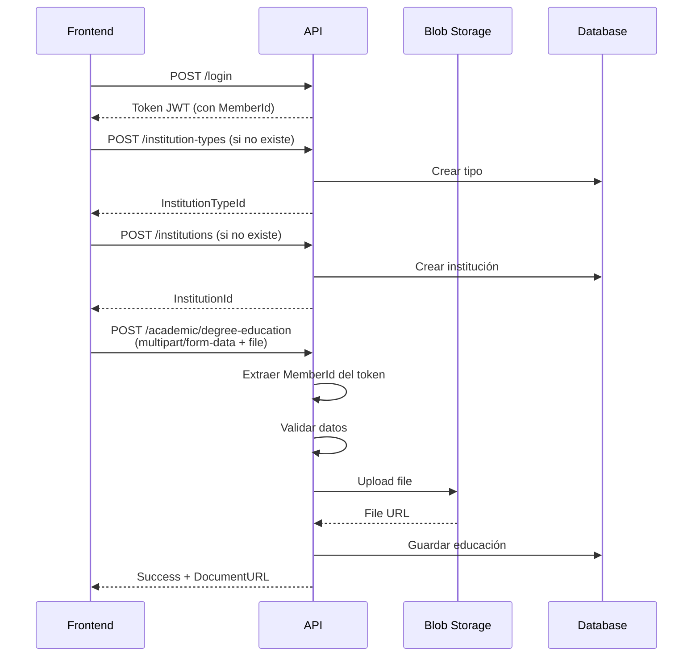

# 📚 Documentación de la API - Coling Backend

Bienvenido a la documentación de la API del sistema de gestión del Colegio de Ingenieros.

## 📋 Índice de Documentación

### 🚀 Para Empezar
- **[Quick Reference](./QUICK-REFERENCE.md)** - Referencia rápida de todos los endpoints
- **[API Endpoints](./API-ENDPOINTS.md)** - Documentación completa y detallada

### 🔗 Endpoints Disponibles

#### Autenticación
- `POST /api/users/login` - Inicio de sesión
- `POST /api/users/register-member` - Registro de miembro

#### Academic Management
- `POST /api/academic/degree-education` - Registrar grado académico (con archivo)

#### Institution Management
- `POST /api/institution-types` - Registrar tipo de institución
- `POST /api/institutions` - Registrar institución

#### Members Management
- `GET /api/members/pending` - Obtener miembros pendientes
- `POST /api/members/approve` - Aprobar miembro
- `POST /api/members/reject` - Rechazar miembro

---

## 🎯 Características Principales

### Seguridad y Autenticación
- ✅ JWT Token con claims personalizados
- ✅ Extracción automática de `MemberId` del token
- ✅ Autorización basada en roles (Admin, Moderador, Miembro)
- ✅ Middleware de autenticación personalizado

### Gestión de Archivos
- ✅ Upload de archivos a Azure Blob Storage
- ✅ Nombres únicos: `{memberId}_{guid}.{extension}`
- ✅ Contenedor: `academic-documents`
- ✅ Soporte multipart/form-data

### Validaciones
- ✅ Data Annotations en DTOs
- ✅ Validación de modelos
- ✅ Validación de duplicados
- ✅ Validación de existencia de entidades relacionadas

---

## 🔑 Claims en el Token JWT

Cuando un usuario inicia sesión, recibe un token JWT que contiene:

| Claim | Descripción | Ejemplo |
|-------|-------------|---------|
| `sub` | User ID | "guid" |
| `nameid` | User ID | "guid" |
| `unique_name` | Username | "jperez" |
| `name` | First names | "Juan Carlos" |
| `email` | Email | "juan@example.com" |
| `PersonId` | Person ID | "guid" |
| `FullName` | Full name | "Juan Carlos Pérez García" |
| `MemberId` | Member ID (si es miembro) | "guid" |
| `role` | Role | "Miembro" |

---

## 📊 Estructura de Respuestas

### ✅ Respuesta Exitosa

```json
{
  "wasSuccessful": true,
  "message": "Operación exitosa",
  "data": { /* datos del recurso */ },
  "errors": null
}
```

### ❌ Respuesta con Error

```json
{
  "wasSuccessful": false,
  "message": "Mensaje de error principal",
  "data": null,
  "errors": [
    "Error específico 1",
    "Error específico 2"
  ]
}
```

---

## 🔄 Flujo de Trabajo Recomendado

### Para Registrar un Grado Académico



---

## 🛠️ Ejemplos de Uso

### React/TypeScript

```typescript
import axios from 'axios';

// Configuración de Axios
const api = axios.create({
  baseURL: 'http://localhost:7071/api',
  headers: {
    'Content-Type': 'application/json'
  }
});

// Interceptor para agregar token
api.interceptors.request.use(config => {
  const token = localStorage.getItem('token');
  if (token) {
    config.headers.Authorization = `Bearer ${token}`;
  }
  return config;
});

// Registrar grado académico con archivo
const registerDegreeEducation = async (data: any, file?: File) => {
  const formData = new FormData();

  // Agregar campos
  Object.keys(data).forEach(key => {
    if (data[key] != null) {
      formData.append(key, data[key].toString());
    }
  });

  // Agregar archivo si existe
  if (file) {
    formData.append('document', file);
  }

  const response = await api.post('/academic/degree-education', formData, {
    headers: { 'Content-Type': 'multipart/form-data' }
  });

  return response.data;
};

// Crear institución
const createInstitution = async (data: any) => {
  const response = await api.post('/institutions', data);
  return response.data;
};
```

### JavaScript/Fetch

```javascript
// Login
const login = async (userName, password) => {
  const response = await fetch('http://localhost:7071/api/users/login', {
    method: 'POST',
    headers: { 'Content-Type': 'application/json' },
    body: JSON.stringify({ userName, password })
  });

  const data = await response.json();
  if (data.wasSuccessful) {
    localStorage.setItem('token', data.data.token);
  }
  return data;
};

// Crear tipo de institución
const createInstitutionType = async (name, description) => {
  const token = localStorage.getItem('token');

  const response = await fetch('http://localhost:7071/api/institution-types', {
    method: 'POST',
    headers: {
      'Content-Type': 'application/json',
      'Authorization': `Bearer ${token}`
    },
    body: JSON.stringify({ name, description })
  });

  return await response.json();
};
```

---

## 🧪 Testing

### Archivos HTTP de Prueba

Los archivos `.http` están disponibles en la carpeta `tests/`:

- `tests/login.http` - Autenticación
- `tests/academic-management.http` - Gestión académica
- `tests/institution-management.http` - Gestión de instituciones
- `tests/members-management.http` - Gestión de miembros

### Variables de Entorno

```
@baseUrl = http://localhost:7071/api
@token = YOUR_JWT_TOKEN_HERE
```

---

## 📦 Configuración Requerida

### local.settings.json

```json
{
  "IsEncrypted": false,
  "Values": {
    "AzureWebJobsStorage": "UseDevelopmentStorage=true",
    "FUNCTIONS_WORKER_RUNTIME": "dotnet-isolated",
    "ConnectionStrings:DefaultConnection": "Server=(localdb)\\mssqllocaldb;...",
    "AzureBlobStorage": "DefaultEndpointsProtocol=https;AccountName=...;...",
    "Jwt:Key": "your-secret-key-here",
    "Jwt:Issuer": "ColingAPI",
    "Jwt:Audience": "ColingClient"
  }
}
```

---

## ❓ Preguntas Frecuentes

### ¿Por qué el endpoint de grado académico usa multipart/form-data?

Para soportar la carga de archivos (documentos PDF, imágenes) junto con los datos del formulario.

### ¿Cómo se obtiene el MemberId?

Se extrae automáticamente del claim `MemberId` del token JWT. No es necesario enviarlo en el body.

### ¿Qué pasa si falla la subida del archivo?

Si la subida del archivo falla, toda la transacción hace rollback. No se crea ni el DegreeEducation ni el MemberEducation.

### ¿Las fechas son obligatorias?

No, las fechas son opcionales y flexibles. Puedes enviar:
- Solo año: `startYear: 2020`
- Año y mes: `startYear: 2020, startMonth: 3`
- Completo: `startYear: 2020, startMonth: 3, startDay: 15`

### ¿Cómo manejo errores de validación?

Los errores vienen en el array `errors` de la respuesta:

```json
{
  "wasSuccessful": false,
  "message": "Errores de validación",
  "errors": [
    "El nombre es requerido",
    "El GPA debe estar entre 0 y 100"
  ]
}
```

---

## 📞 Soporte

Para más información, consulta:
- [Documentación completa de endpoints](./API-ENDPOINTS.md)
- [Referencia rápida](./QUICK-REFERENCE.md)
- [CLAUDE.md](../CLAUDE.md) - Guía del proyecto

---

## 🔄 Actualizaciones Recientes

### v1.0.0 (2025-10-10)
- ✅ Endpoint de registro de grado académico con carga de archivos
- ✅ Endpoint de registro de instituciones
- ✅ Endpoint de registro de tipos de institución
- ✅ Extracción automática de MemberId del token JWT
- ✅ Integración con Azure Blob Storage
- ✅ Validaciones completas de duplicados y existencia
